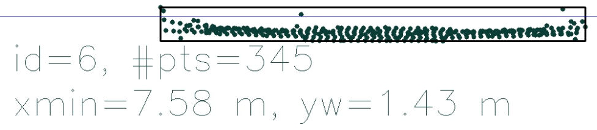
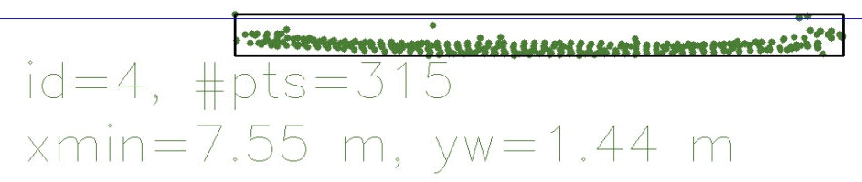
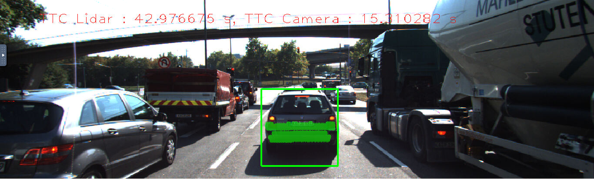
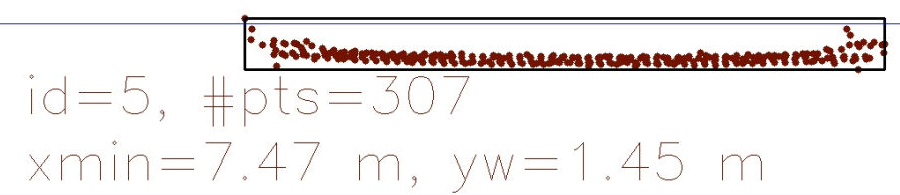
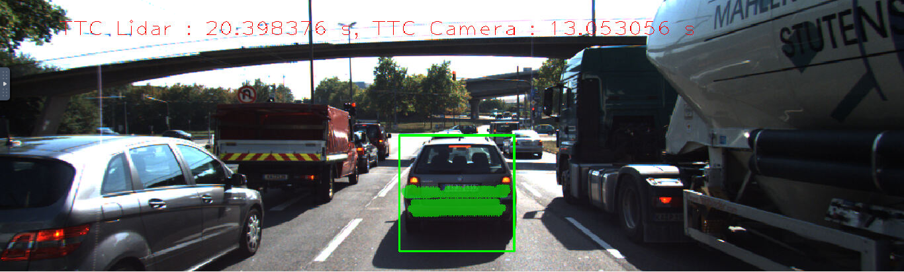
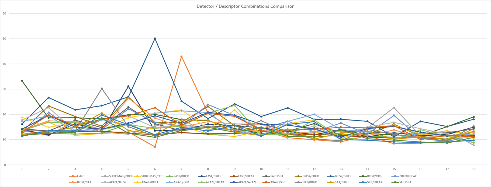

# SFND  Track an Object in 3D Space Writeup

## Match 3D Objects

The YOLOv3 model is used in detecting objects in acquired 2D camera image. Each detected object is enclosed by a bounding box. In order to track objects in the scene over time, we need to track those bounding boxes. By matching bounding boxes in consecutive images and knowing that we are working with the same object evolving in the environment, in the preceding vehicle case, we will be able to estimate the Time To Collision (TTC) as a result of proper traking of the preceding vehicle.	
To tackle the previously stated challenge the method `matchBoundingBoxes` is implemented, which takes as input both the previous and the current data frames and provides as output the ids of the matched regions of interest, the `boxID` property. Also, matches must be the ones with the highest number of keypoint correspondences.  So, a 2D vector `matchingScores` is created to store the scores of each box in the previous frame versus the scores of each box in the current frame and based on the scores we select the best matching bounding boxes.

    void matchBoundingBoxes(std::vector<cv::DMatch> &matches, std::map<int, int> &bbBestMatches, DataFrame &prevFrame, DataFrame &currFrame)
    {
        int prevBoundingBoxesSize = prevFrame.boundingBoxes.size();
        int currBoundingBoxesSize = currFrame.boundingBoxes.size();
        std::vector< std::vector<int> > matchingScores(prevBoundingBoxesSize, std::vector<int>(currBoundingBoxesSize,0));
        
        for(auto match : matches)
        {
            cv::Point2f prevPoint = prevFrame.keypoints.at(match.queryIdx).pt;
            cv::Point2f currPoint = currFrame.keypoints.at(match.trainIdx).pt;
            
            std::vector<int> prevBoxIDPerKeypoint, currBoxIDPerKeypoint;
            for(auto boundingBox : prevFrame.boundingBoxes)
            {
                if(boundingBox.roi.contains(prevPoint))
                {
                    prevBoxIDPerKeypoint.emplace_back(boundingBox.boxID);
                }
            }
    
            for(auto boundingBox : currFrame.boundingBoxes)
            {
                if(boundingBox.roi.contains(currPoint))
                {
                    currBoxIDPerKeypoint.emplace_back(boundingBox.boxID);
                }
            }
            
            for(auto prevBoxID : prevBoxIDPerKeypoint)
            {
                for(auto currBoxID : currBoxIDPerKeypoint)
                {
                    matchingScores.at(prevBoxID).at(currBoxID)++;
                }
            }
        }
    
        for(size_t prevBoxID=0; prevBoxID < prevBoundingBoxesSize; prevBoxID++)
        {
            int currBoxID = std::max_element(matchingScores.at(prevBoxID).begin(), matchingScores.at(prevBoxID).end()) - matchingScores.at(prevBoxID).begin();
            int maxMatchingScore = matchingScores.at(prevBoxID).at(currBoxID);
            if(maxMatchingScore == 0)
            {
                continue;
            }
            else
            {
                bbBestMatches.emplace(prevBoxID, currBoxID);
            }
            
        }
    }

## Compute Lidar-based TTC

The time-to-collision in second for all matched 3D objects is computed using the Lidar measurements from the matched bounding boxes between current and previous frame.

To acquire a robust Lidar measurements, the following steps is used:
1. Filter out low reflectivity Lidar points.
2. Aqcuire the `kPoints`  Lidar points with the smalles distance in X-direction.
3. Filter out the outlier points in the smallest `kPoints`  Lidar points based on `distanceDiffThres`.
4. Take the average of the remaining smallest points.

	    double findClosestLidarPointDistance(std::vector<LidarPoint> &lidarPoints, double &reflectivityThres, 
											  int &kPoints, double &distanceDiffThres)
	    {
	        const int n = kPoints - 1;
	    
	        // Filter out low reflectivity Lidar points
	        lidarPoints.erase(std::remove_if(lidarPoints.begin(),
                                             lidarPoints.end(),
                                             [&reflectivityThres](const LidarPoint& pt)-> bool 
                                             { return pt.r < reflectivityThres; }), 
	                          lidarPoints.end());
	        
	        // Sorting the first kPoints of Lidar points
	        std::nth_element(lidarPoints.begin(), 
		                     lidarPoints.begin() + n, 
		                     lidarPoints.end(), 
		                     {return a.x < b.x;});
	    
	        double nth_distance = lidarPoints.at(n).x;
	    
	        int cnt = 1;
	        double distance = nth_distance;
	    
	        for(int i=0; i < n; i++)
	        {   
	            double pointDistance = lidarPoints.at(i).x;
	    
	            // Filter out the outlier points
	            if((nth_distance - pointDistance) > distanceDiffThres)
	            {
	                continue;
	            }
	            else
	            {
	                distance += pointDistance;
	                cnt++;
	            }
	        }
	    
	        double avgDistance = distance / cnt;
	        std::cout << "Xmin for Lidar TTC computation: " << avgDistance << std::endl;
	        return avgDistance;
	    }

	    void computeTTCLidar(std::vector<LidarPoint> &lidarPointsPrev,
	                         std::vector<LidarPoint> &lidarPointsCurr, double frameRate, double &TTC)
	    {
	        double reflectivityThres = 0.25;
	        int kPoints = 10;
	        double distanceDiffThres = 0.04;
	        
	        double prevDistance = findClosestLidarPointDistance(lidarPointsPrev, 
														         reflectivityThres, 
														         kPoints, 
														         distanceDiffThres);
	        double currDistance = findClosestLidarPointDistance(lidarPointsCurr, 
														         reflectivityThres, 
														         kPoints, 
														         distanceDiffThres);
	    
	        TTC = currDistance / (frameRate * (prevDistance - currDistance));
	        std::cout << "TTC Lidar: "<< TTC <<  "S" << std::endl;
	    }

## Associate Keypoint Correspondences with Bounding Boxes

Prepare the TTC computation based on camera measurements by associating keypoint correspondences to the bounding box of the preceding vehicle which encloses them. So, the key points in previous and current frames are matched and checked if they are within the ROI of the preceding vehicle as follows:

1. Cluster all `KptMatches` With boundingBox's ROI
2. Calculate the average Euclidean distance`averageDistance` between the matched points in the previous and current frames.
3. Filter out the outliers in the `bbKptMatches` and `bbKeypoints` that have Euclidean distance too far away from the mean distance based on the `distanceThreshold`.

	    void clusterKptMatchesWithROI(BoundingBox &boundingBox, std::vector<cv::KeyPoint> &kptsPrev, std::vector<cv::KeyPoint> &kptsCurr, std::vector<cv::DMatch> &kptMatches)
	    {
	        std::vector<cv::KeyPoint> bbKeypoints;
	        std::vector<cv::DMatch> bbKptMatches;
	        std::vector<double> euclideanDistances;
	    
	        // Cluster KptMatches With boundingBox's ROI
	        double averageDistance = 0;
	        for(auto match : kptMatches)
	        {
	            cv::Point2f prevPoint = kptsPrev.at(match.queryIdx).pt;
	            cv::KeyPoint currKeypoint = kptsCurr.at(match.trainIdx);
	            cv::Point2f currPoint = currKeypoint.pt;
	    
	            if(boundingBox.roi.contains(currPoint))
	            {
	                double euclideanDistance = cv::norm(currPoint - prevPoint);
	                averageDistance += euclideanDistance;
	                euclideanDistances.emplace_back(euclideanDistance);
	                bbKeypoints.emplace_back(currKeypoint);
	                bbKptMatches.emplace_back(match);
	            }
	        }
	    
	        averageDistance = averageDistance / euclideanDistances.size();
	    
	        // Filter out the outliers in the KptMatches that are too far away from the mean distance
	        double distanceThreshold = 1.25 * averageDistance;
	    
	        int i = 0;
	        for(auto distance : euclideanDistances)
	        {
	            if(distance >= distanceThreshold)
	            {
	                bbKeypoints.erase(bbKeypoints.begin() + i);
	                bbKptMatches.erase(bbKptMatches.begin() + i);
	            }else
	            {
	                i++;
	            }        
	        }
	    
	        boundingBox.keypoints = bbKeypoints;
	        boundingBox.kptMatches = bbKptMatches;
	    }

## Compute Camera-based TTC

The time-to-collision in second is computed for all matched 3D objects using only keypoint correspondences from the matched bounding boxes between current and previous frame.

    void computeTTCCamera(std::vector<cv::KeyPoint> &kptsPrev, std::vector<cv::KeyPoint> &kptsCurr, 
                          std::vector<cv::DMatch> kptMatches, double frameRate, double &TTC, cv::Mat *visImg)
    {
        // Compute distance ratios between all matched keypoints
        vector<double> distRatios;
        for (auto it1 = kptMatches.begin(); it1 != kptMatches.end() - 1; ++it1)
        {
            // Get current keypoint and its matched partner in the prev. frame
            cv::KeyPoint kpOuterCurr = kptsCurr.at(it1->trainIdx);
            cv::KeyPoint kpOuterPrev = kptsPrev.at(it1->queryIdx);
    
            for (auto it2 = it1 + 1; it2 != kptMatches.end(); ++it2)
            {
                double minDist = 100.0; // min. required distance
    
                // Get next keypoint and its matched partner in the prev. frame
                cv::KeyPoint kpInnerCurr = kptsCurr.at(it2->trainIdx);
                cv::KeyPoint kpInnerPrev = kptsPrev.at(it2->queryIdx);
    
                // Compute distances and distance ratios
                double distCurr = cv::norm(kpOuterCurr.pt - kpInnerCurr.pt);
                double distPrev = cv::norm(kpOuterPrev.pt - kpInnerPrev.pt);
    
                // Avoid division by zero
                if (distPrev > std::numeric_limits<double>::epsilon() && distCurr >= minDist)
                {
                    double distRatio = distCurr / distPrev;
                    distRatios.push_back(distRatio);
                }
            }
        }
    
        // Only continue if list of distance ratios is not empty
        if (distRatios.size() == 0)
        {
            TTC = NAN;
            return;
        }
    
        // Compute camera-based TTC based on median distance ratios to avoid outliers
        auto n = distRatios.size() / 2;
        nth_element(distRatios.begin(), distRatios.begin() + n, distRatios.end());
        double medDistRatio = distRatios.at(n);
    
        // If the distRatios size is even
        if(!(distRatios.size() & 1))
        {
            auto max_it = max_element(distRatios.begin(), distRatios.begin()+n);
            medDistRatio = (*max_it + medDistRatio) / 2.0;
        }
        
        TTC = -1.0 / (frameRate * (1 - medDistRatio));
        std::cout << "TTC Camera: "<< TTC <<  "S" << std::endl;
    }

## Statistical Analysis 

### Performance Evaluation 1
Find examples where the TTC estimate of the Lidar sensor does not seem plausible. Describe your observations and provide a sound argumentation why you think this happened.

#### Example 1

Previous frame |  Current frame 
:-------------------------:|:-------------------------:
 |  

 Scene |
:-------------------------:|
 |

##### TTC using Lidar readings (Using the developed algorithm)

 - previous Xmin for Lidar TTC computation: 7.5815 m
 - current Xmin for Lidar TTC computation: 7.5639 m
 - TTC Lidar: 42.9767S

##### TTC using Lidar readings (Manually calculated)

 - previous Xmin for Lidar TTC computation: 7.58 m
 - current Xmin for Lidar TTC computation: 7.55 m

$$
TTC Lidar = \frac{Distance_{curr}}{frameRate \cdot (Distance_{prev} - Distance_{curr})}
$$

$$
TTC Lidar = \frac{7.55}{10 \cdot (7.58 - 7.55)} = 25.1667~S
$$

#### Example 2

Previous frame |  Current frame 
:-------------------------:|:-------------------------:
 |  

 Scene |
:-------------------------:|
 |

##### TTC using Lidar readings (Using the developed algorithm)

 - previous Xmin for Lidar TTC computation: 7.5639 m
 - current Xmin for Lidar TTC computation: 7.527 m
 - TTC Lidar: 20.3984 S

##### TTC using Lidar readings (Manually calculated)

 - previous Xmin for Lidar TTC computation: 7.55 m
 - current Xmin for Lidar TTC computation: 7.47 m but the Lidar measurments have two significant outliers ponits so actual Xmin may be 7.5 m

$$
TTC Lidar = \frac{Distance_{curr}}{frameRate \cdot (Distance_{prev} - Distance_{curr})}
$$

$$
TTC Lidar = \frac{7.47}{10 \cdot (7.55 - 7.47)} = 9.3375~S
$$

$$
TTC Lidar_{OutliersRemoved} = \frac{7.5}{10 \cdot (7.55 - 7.5)} = 15~S
$$

#### Discussion
As seen from the results the developed algorithm is robust against outliers in the Lidar measurements (Little deviations between the calculated Xmin using the developed algorithm and the manually calculated one). 
But a safety margin should be added (By subtracting a faction from the calculated Xmin) so that even the Lidar measurements have outliers the calculated TTC ensures that the car operates safely. 
Also using the Constant Velocity Model (CVM), which supposes that the relative velocity between the ego vehicle and the preceding vehicle is constant, affects the calculated TTC. 
Using a Constant Acceleration Model (CAM) will result in more accurate calculations.

### Performance Evaluation 2

Run several detector / descriptor combinations and look at the differences in TTC estimation. Find out which methods perform best and also include several examples where camera-based TTC estimation is way off. As with Lidar, describe your observations again and also look into potential reasons.

#### Discussion

**Note:** Brute Force (BF) and KNN with k=2 and distance ratio filtering = 0.8 are used in the keypoints matching process.

 - The comparison between the combination of all possible detector and descriptor in terms of detected keypoints, matched keypoints, and computational speed can be found [here](https://github.com/KirolosWahba/SFND-Camera-Based-2D-Feature-Tracking/blob/master/Report.md).
 - The comparison results can be found [here](/report/TTCLidarVsCameraPerformanceComparison.xlsx).

**Note:** Using the Harris and Orb detectors and their combinations results in bad TTC estimation performance. As these detectors are typically the ones with the least number of detected keypoints. This, therefore, introduces a greater noise and a greater probability of the keypoint not being successfully associated with the preceding vehicle's bounding box at all. 
This then leads to a high number of not valid values when using these detectors.

 ALL detector/descriptor combinations comparison |
:-------------------------:|
 |

Top-3 detector/descriptor combinations |
:-------------------------:|
 |
